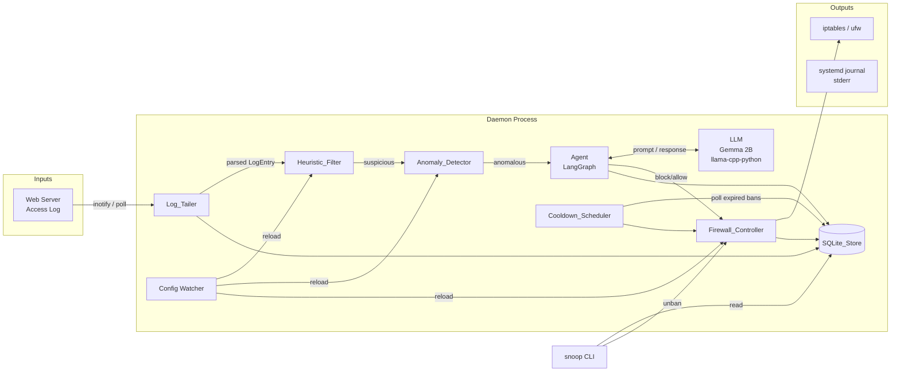

# Design Document: snoop-ips-daemon

## Overview

Snoop is a Python daemon implementing a three-stage Intrusion Prevention System (IPS) pipeline for Linux servers. It tails web server access logs in real time, passes entries through a heuristic filter, then an ML-based anomaly detector, and finally a LangGraph-orchestrated LLM agent that decides whether to block an IP via iptables/ufw. All state lives in a local SQLite database; a `snoop` CLI exposes status, audit, and ban-management commands. The system is designed for zero-configuration privacy-preserving operation: no data ever leaves the host.

Key design constraints:
- All inference is local (llama-cpp-python + Gemma 2B)
- No external service dependencies at runtime
- Hot-reload of whitelist, heuristic patterns, and anomaly threshold from config.yaml within 60 s
- Graceful SIGTERM shutdown within 10 s
- IP command injection is categorically prevented by format validation before any subprocess call

---

## Architecture

The daemon is structured as a set of async Python components coordinated by a central `Daemon` supervisor. The three pipeline stages form a left-to-right processing chain; each stage communicates via an `asyncio.Queue`.



### Process Model

- Single Python process; async event loop (asyncio) manages all I/O concurrency.
- LLM inference runs in a `ThreadPoolExecutor` to avoid blocking the event loop.
- All pipeline queues are bounded to provide backpressure and prevent memory exhaustion under flood conditions.
- The `Cooldown_Scheduler` runs as a periodic asyncio task (not a separate process).
- The `Config` watcher uses `watchdog` (inotify on Linux) to detect `config.yaml` changes.

---

## Components and Interfaces

### Daemon (supervisor)

Responsibilities: bootstrap, lifecycle management, wiring components together, signal handling.

```python
class Daemon:
    def start(self) -> None: ...
    def stop(self) -> None: ...          # called on SIGTERM
    def reload_config(self) -> None: ... # called on SIGHUP / file change
```

- Writes PID file on start; removes it on clean exit.
- Registers SIGTERM → `stop()`, SIGHUP → `reload_config()`.
- Blocks second-instance launch by checking PID file + process liveness.

---

### Log_Tailer

Responsibilities: open the configured log file, stream new lines, detect rotation, parse each line.

```python
class LogTailer:
    async def start(self) -> None: ...
    async def stop(self) -> None: ...

@dataclass
class LogEntry:
    source_ip: str
    method: str
    path: str
    status_code: int
    user_agent: str
    raw_line: str
    timestamp: datetime
```

- Uses `aiofiles` for non-blocking reads; polls via `asyncio.sleep(0.1)` between reads, plus an inotify watcher for rotation detection.
- On rotation: detects inode change or file truncation; re-opens the new file.
- Unparse-able lines increment `parse_error_counter`; line is discarded.
- Emits `LogEntry` objects onto `heuristic_queue`.

---

### Heuristic_Filter

Responsibilities: fast pattern matching; triage log entries as benign or suspicious.

```python
class HeuristicFilter:
    def evaluate(self, entry: LogEntry) -> FilterResult: ...
    def reload_patterns(self, patterns: list[PatternRule]) -> None: ...

@dataclass
class PatternRule:
    name: str
    pattern: re.Pattern
    field: str   # "path" | "user_agent" | "method" | ...

class FilterResult(Enum):
    BENIGN = "benign"
    SUSPICIOUS = "suspicious"
```

- Evaluates all patterns; if any match → SUSPICIOUS → forward to anomaly queue.
- `reload_patterns()` swaps the internal pattern list atomically (no lock needed; GIL + single assignment).
- Target: ≤ 10 ms per entry.

---

### Anomaly_Detector

Responsibilities: feature extraction, IsolationForest scoring, rate-limited escalation to Agent.

```python
class AnomalyDetector:
    def score(self, entry: LogEntry) -> float: ...
    def should_escalate(self, score: float) -> bool: ...
    async def retrain(self) -> None: ...

@dataclass
class FeatureVector:
    path_length: int
    query_entropy: float
    method_encoded: int
    status_code: int
    user_agent_length: int
```

- IsolationForest from `scikit-learn`; model serialized with `joblib` to a file path from Config.
- Rate limiter uses a token-bucket algorithm; max escalation rate is configurable.
- On startup with no model file: trains from `traffic_history`; falls back to heuristic-only mode if `< MIN_TRAINING_SAMPLES` rows.
- `retrain()` trains a new model in-memory, then atomically replaces the active model reference.

---

### Agent (LangGraph workflow)

Responsibilities: orchestrate Investigate → Reason → Act; call LLM; write audit log.

```python
class Agent:
    async def run(self, entry: LogEntry) -> AgentDecision: ...

@dataclass
class AgentState:
    entry: LogEntry
    traffic_history: list[TrafficRecord]
    llm_assessment: LLMAssessment | None
    action: Action | None
    error: str | None

@dataclass
class LLMAssessment:
    threat_label: str
    confidence: float          # 0.0–1.0
    recommended_action: str    # "block" | "allow"
    ban_duration_seconds: int | None
    reasoning: str

@dataclass
class AgentDecision:
    action: Action
    assessment: LLMAssessment | None
    execution_trace: dict

class Action(Enum):
    BLOCK = "block"
    ALLOW = "allow"
```

LangGraph graph definition:

```python
graph = StateGraph(AgentState)
graph.add_node("investigate", investigate_node)
graph.add_node("reason", reason_node)
graph.add_node("act", act_node)
graph.add_edge("investigate", "reason")
graph.add_edge("reason", "act")
graph.set_entry_point("investigate")
```

- `investigate_node`: queries `SQLite_Store` for source IP history.
- `reason_node`: calls LLM with structured prompt; parses JSON response; timeout = 30 s; on timeout or parse error → `assessment = None`.
- `act_node`: if `assessment is None` or unparseable → `ALLOW`; otherwise delegates to `Firewall_Controller`.
- Full trace + assessment + action written to `threat_audit_log`.

---

### LLM (llama-cpp-python wrapper)

Responsibilities: load Gemma 2B, serve inference, enforce timeout.

```python
class LLMClient:
    def load(self) -> None: ...
    def infer(self, prompt: str, timeout: float = 30.0) -> str: ...
```

- Loaded once at daemon startup in a thread; blocks Agent processing until ready.
- On model load failure: logs fatal error, sets `agent_enabled = False`; daemon continues in heuristic+anomaly mode.
- Inference executed in `ThreadPoolExecutor`; `asyncio.wait_for` enforces the 30 s timeout.

Prompt template (structured JSON output enforced via system prompt):

```
System: You are a security analyst. Analyze the following HTTP request and traffic history.
Respond ONLY with a JSON object matching this schema:
{"threat_label": string, "confidence": float, "recommended_action": "block"|"allow",
 "ban_duration_seconds": int|null, "reasoning": string}

User:
Suspicious request: {entry}
Recent traffic history for {ip}: {history_summary}
```

---

### Firewall_Controller

Responsibilities: IP validation, iptables/ufw command execution, active_bans persistence.

```python
class FirewallController:
    def block(self, ip: str, reason: str, duration_s: int) -> None: ...
    def unblock(self, ip: str) -> None: ...
    def is_whitelisted(self, ip: str) -> bool: ...
    def restore_bans(self) -> None: ...   # called on daemon start
```

- IP validation uses `ipaddress.ip_address()` (stdlib); rejects anything that raises `ValueError`.
- Whitelist check is performed synchronously before any subprocess call; always includes `127.0.0.1` and `::1`.
- Subprocess commands constructed as argument lists (no shell=True) to prevent injection.
- `restore_bans()` iterates unexpired rows in `active_bans` and re-applies DROP rules on startup.

Backends:
- `iptables`: `iptables -I INPUT -s <ip> -j DROP` / `iptables -D INPUT -s <ip> -j DROP`
- `ufw`: `ufw insert 1 deny from <ip>` / `ufw delete deny from <ip>`

---

### Cooldown_Scheduler

Responsibilities: periodic poll of `active_bans`; trigger unban when `expires_at` has elapsed.

```python
class CooldownScheduler:
    async def run(self) -> None: ...  # infinite loop with configurable sleep interval
```

- Polls every `poll_interval_s` seconds (default: 60).
- On expired ban found: calls `FirewallController.unblock(ip)` → on success, deletes row from `active_bans` and appends unban event to `threat_audit_log`.
- On unblock failure: retains row, logs failure, retries next cycle.

---

### SQLite_Store

Responsibilities: schema initialization, all database read/write operations, WAL mode.

```python
class SQLiteStore:
    def initialize(self) -> None: ...
    def insert_traffic(self, entry: LogEntry) -> None: ...
    def get_traffic_history(self, ip: str, limit: int) -> list[TrafficRecord]: ...
    def insert_ban(self, ban: BanRecord) -> None: ...
    def get_active_bans(self) -> list[BanRecord]: ...
    def delete_ban(self, ip: str) -> None: ...
    def append_audit(self, event: AuditEvent) -> None: ...
    def get_recent_audit(self, n: int) -> list[AuditEvent]: ...
    def prune_traffic_history(self, retention_s: int) -> None: ...
```

- Opens with `PRAGMA journal_mode=WAL` on every connection.
- `threat_audit_log` writes are INSERT-only; `SQLiteStore` does not expose update/delete for that table.
- `prune_traffic_history` called after every `insert_traffic` write cycle.
- Database file auto-created with schema on first connection (`initialize()`).

---

### Config

Responsibilities: parse, validate, and hot-reload `config.yaml`.

```python
@dataclass
class Config:
    log_file_path: str
    log_format: str
    firewall_backend: Literal["iptables", "ufw"]
    whitelist: list[str]               # IPs and CIDR subnets
    anomaly_threshold: float
    max_escalation_rate: int           # per minute
    llm_model_path: str
    default_ban_duration_s: int
    traffic_retention_s: int           # default: 86400
    heuristic_patterns: list[PatternRule]
    pid_file_path: str
    db_path: str
    poll_interval_s: int               # cooldown scheduler

class ConfigLoader:
    def load(self, path: str) -> Config: ...
    def validate(self, raw: dict) -> Config: ...  # raises ConfigValidationError on bad input
```

- Parsed with `PyYAML`; validated field-by-field with type coercion.
- Missing required fields → `ConfigValidationError` with descriptive message; daemon exits non-zero.
- Config watcher thread calls `daemon.reload_config()` after detecting a file change; debounced to 5 s to avoid rapid reloads.

---

### CLI

Responsibilities: provide `snoop` command-line interface.

Built with `typer` (or `argparse` as fallback). Communicates with the SQLite database directly for reads; calls `FirewallController` for unban operations.

```
snoop status                  # daemon state, active ban count, pipeline counters
snoop audit [--limit N]       # N most recent threat_audit_log records
snoop ban list                # all active_bans records
snoop unban <ip>              # remove DROP rule + active_bans record
snoop whitelist check <ip>    # whether IP is whitelisted
```

- All commands check daemon liveness (PID file + process check).
- If daemon offline: `snoop status` shows "offline"; all other commands display message and exit non-zero.
- `snoop unban` for non-banned IP: informative message, exit 0.

---

## Data Models

### SQLite Schema

```sql
-- Rolling traffic buffer; pruned to retention window
CREATE TABLE IF NOT EXISTS traffic_history (
    id          INTEGER PRIMARY KEY AUTOINCREMENT,
    source_ip   TEXT    NOT NULL,
    method      TEXT    NOT NULL,
    path        TEXT    NOT NULL,
    status_code INTEGER NOT NULL,
    user_agent  TEXT,
    raw_line    TEXT,
    observed_at TEXT    NOT NULL   -- ISO-8601 UTC
);
CREATE INDEX IF NOT EXISTS idx_traffic_ip ON traffic_history(source_ip);
CREATE INDEX IF NOT EXISTS idx_traffic_time ON traffic_history(observed_at);

-- Currently blocked IPs
CREATE TABLE IF NOT EXISTS active_bans (
    ip          TEXT    PRIMARY KEY,
    reason      TEXT    NOT NULL,
    banned_at   TEXT    NOT NULL,   -- ISO-8601 UTC
    expires_at  TEXT    NOT NULL    -- ISO-8601 UTC
);

-- Append-only threat investigation record
CREATE TABLE IF NOT EXISTS threat_audit_log (
    id              INTEGER PRIMARY KEY AUTOINCREMENT,
    source_ip       TEXT    NOT NULL,
    entry_raw       TEXT    NOT NULL,
    threat_label    TEXT,
    confidence      REAL,
    recommended_action TEXT,
    final_action    TEXT    NOT NULL,
    reasoning       TEXT,
    execution_trace TEXT,           -- JSON blob
    error           TEXT,
    occurred_at     TEXT    NOT NULL -- ISO-8601 UTC
);
CREATE INDEX IF NOT EXISTS idx_audit_time ON threat_audit_log(occurred_at);
CREATE INDEX IF NOT EXISTS idx_audit_ip ON threat_audit_log(source_ip);
```

### config.yaml Structure

```yaml
log_file_path: /var/log/nginx/access.log
log_format: "$remote_addr - $remote_user [$time_local] \"$request\" $status $body_bytes_sent \"$http_referer\" \"$http_user_agent\""
firewall_backend: iptables         # or ufw
whitelist:
  - 127.0.0.1
  - ::1
  - 10.0.0.0/8
anomaly_threshold: 0.3             # IsolationForest score threshold
max_escalation_rate: 10            # Agent invocations per minute
llm_model_path: /opt/snoop/models/gemma-2b.gguf
default_ban_duration_s: 3600       # 1 hour
traffic_retention_s: 86400         # 24 hours
poll_interval_s: 60                # Cooldown_Scheduler interval
pid_file_path: /var/run/snoop.pid
db_path: /var/lib/snoop/snoop.db
heuristic_patterns:
  - name: sql_injection
    field: path
    pattern: "(?i)(union|select|insert|drop|exec|xp_)"
  - name: path_traversal
    field: path
    pattern: "\\.\\./|\\.\\.\\\\"
  - name: shell_injection
    field: path
    pattern: "(?i)(;|\\||`|\\$\\()"
```

---

## Correctness Properties

*A property is a characteristic or behavior that should hold true across all valid executions of a system — essentially, a formal statement about what the system should do. Properties serve as the bridge between human-readable specifications and machine-verifiable correctness guarantees.*

### Property 1: Log line parse round-trip

*For any* valid log line conforming to the configured format, parsing the line with `LogTailer` should extract all required fields (source IP, method, path, status code, User-Agent) whose values round-trip back to substrings present in the original raw line.

**Validates: Requirements 1.5**

---

### Property 2: Malformed lines increment counter and are dropped

*For any* string that does not match the configured log format, passing it to the parser should increment the `parse_error_counter` by exactly one and not produce a `LogEntry`.

**Validates: Requirements 1.6**

---

### Property 3: Heuristic filter result is exactly SUSPICIOUS iff at least one pattern matches

*For any* `LogEntry` and any non-empty set of `PatternRule` objects, `HeuristicFilter.evaluate()` returns `SUSPICIOUS` if and only if at least one pattern matches any relevant field in the entry; otherwise it returns `BENIGN`.

**Validates: Requirements 2.2, 2.3**

---

### Property 4: Feature extraction produces valid numeric vectors

*For any* valid `LogEntry`, `AnomalyDetector` feature extraction produces a `FeatureVector` where all fields are finite numeric values and `path_length >= 0`, `query_entropy >= 0.0`, `user_agent_length >= 0`, and `status_code` is in the range 100–599.

**Validates: Requirements 3.2**

---

### Property 5: Escalation threshold is a sharp boundary

*For any* floating-point anomaly score `s` and configured threshold `t`, `should_escalate(s, t)` returns `True` if and only if `s > t`.

**Validates: Requirements 3.3, 3.4**

---

### Property 6: Rate limiter never exceeds configured maximum

*For any* burst of `N` escalation requests submitted within a 60-second window where `N > max_escalation_rate`, the number of entries actually forwarded to the Agent is at most `max_escalation_rate`.

**Validates: Requirements 3.5**

---

### Property 7: Act node always produces a valid action; defaults to ALLOW on bad input

*For any* value passed to `act_node` as the `llm_assessment` field — including `None`, any malformed or non-JSON string, and any JSON object missing required fields — the act node's output `action` is always either `Action.BLOCK` or `Action.ALLOW`. When `llm_assessment` is `None` or unparseable, the output is always `Action.ALLOW`.

**Validates: Requirements 4.4, 4.5**

---

### Property 8: Every agent invocation appends exactly one audit record

*For any* log entry processed through the full Agent workflow, exactly one record is appended to the `threat_audit_log`, regardless of whether the LLM succeeded, timed out, or returned a malformed response.

**Validates: Requirements 4.7**

---

### Property 9: Prompt always contains required context

*For any* `LogEntry` and any list of `TrafficRecord` objects representing history, the constructed LLM prompt string contains: (a) a serialized representation of the log entry, (b) the source IP address, (c) the JSON output schema instruction.

**Validates: Requirements 5.4**

---

### Property 10: Valid LLM assessments always contain required fields

*For any* string produced by the LLM that is successfully parsed as a `LLMAssessment`, the resulting object has non-empty `threat_label`, a `confidence` value in `[0.0, 1.0]`, and `recommended_action` equal to `"block"` or `"allow"`.

**Validates: Requirements 5.5**

---

### Property 11: IP validation is the gatekeeper — no invalid IP reaches the firewall

*For any* string `s` passed to `FirewallController.block()`, if `s` is not a valid IPv4 or IPv6 address (as determined by `ipaddress.ip_address()`), then no subprocess command is executed and no record is written to `active_bans`. Valid IPs are processed normally.

**Validates: Requirements 6.2, 6.3**

---

### Property 12: Successful block is fully persisted with all required fields

*For any* valid IP address, ban reason, and duration, after `FirewallController.block()` succeeds, the `active_bans` table contains exactly one record for that IP with non-null `reason`, `banned_at`, and `expires_at` fields, where `expires_at > banned_at`.

**Validates: Requirements 6.4**

---

### Property 13: Whitelisted IPs are never blocked

*For any* IP address or CIDR subnet in the configured whitelist — including the always-present `127.0.0.1` and `::1` — calling `FirewallController.block()` with an IP that matches any whitelist entry never invokes any firewall subprocess command.

**Validates: Requirements 7.3, 7.4**

---

### Property 14: Expired bans are fully cleaned up on each polling cycle

*For any* set of bans in `active_bans` with varying `expires_at` timestamps, after one polling cycle of `CooldownScheduler`, every ban whose `expires_at < now` has been removed from `active_bans` and has a corresponding unban event in `threat_audit_log`, while bans with `expires_at >= now` are unchanged.

**Validates: Requirements 8.2, 8.3**

---

### Property 15: Ban duration falls back to configured default when not specified

*For any* `AgentDecision` where `assessment.ban_duration_seconds` is `None` or where `assessment` itself is `None`, the ban duration applied to the `active_bans` record equals `config.default_ban_duration_s`. For any `AgentDecision` where `ban_duration_seconds` is a positive integer, that exact value is used.

**Validates: Requirements 8.5**

---

### Property 16: Traffic history retention is enforced after every write

*For any* set of `traffic_history` entries with varying `observed_at` timestamps, after `SQLiteStore.insert_traffic()` completes, no entry with `observed_at < (now - retention_period)` remains in the table.

**Validates: Requirements 9.2**

---

### Property 17: snoop audit --limit N returns correct count and order

*For any* integer `N >= 0` and any `threat_audit_log` with `M` records, `snoop audit --limit N` returns exactly `min(N, M)` records, ordered by `occurred_at` descending (most recent first).

**Validates: Requirements 10.2**

---

### Property 18: Whitelist check is consistent with is_whitelisted()

*For any* IP address string, the output of `snoop whitelist check <ip>` matches the boolean result of `FirewallController.is_whitelisted(ip)`. There is no IP for which the CLI and the in-process function disagree.

**Validates: Requirements 10.6**

---

### Property 19: Config round-trip serialization

*For any* valid `Config` object, serializing it to YAML via `ConfigLoader` and re-parsing the resulting YAML string produces a `Config` object that is equal to the original (all fields match).

**Validates: Requirements 11.6**

---

## Error Handling

### Pipeline Stage Failures

| Failure Scenario | Behavior |
|---|---|
| Log file unavailable | Log_Tailer retries every 5 s, logs warning to journal; pipeline pauses |
| Log line parse failure | Line discarded, `parse_error_counter` incremented, pipeline continues |
| No trained ML model | Anomaly_Detector falls back to heuristic-only mode; logs warning |
| LLM model file missing | Agent stage disabled; daemon continues in heuristic+anomaly mode; logs fatal |
| LLM timeout (> 30 s) | Act node defaults to ALLOW; timeout logged to audit log |
| LLM malformed output | Act node defaults to ALLOW; failure logged to audit log |
| Firewall command fails (block) | Error logged; no `active_bans` record written |
| Firewall command fails (unblock) | Error logged; `active_bans` record retained; retry on next cooldown cycle |
| Invalid IP to Firewall_Controller | Block request rejected immediately; no subprocess call; input logged |
| Whitelisted IP block attempt | Block aborted synchronously; whitelist-protection event logged |
| SQLite write failure | Error logged to journal; operation retried on next cycle |
| config.yaml missing/invalid | Fatal error logged; daemon exits non-zero |

### Fail-Safe Defaults

The system is designed with a "fail open" philosophy for the AI decision layer — when the LLM or Agent is uncertain or unavailable, the system defaults to ALLOW rather than blocking potentially legitimate traffic. The heuristic and ML layers provide a safety backstop below this.

The whitelist is the only absolute, fail-closed component: no LLM failure, pipeline error, or config reload can cause a whitelisted IP to be blocked.

---

## Testing Strategy

### Unit Tests (example-based)

Cover specific behaviors, edge cases, and error conditions:

- `LogTailer`: file rotation detection, parse-error counter, field extraction for known log formats
- `HeuristicFilter`: pattern matching with specific known-bad and known-good inputs; `reload_patterns()` atomicity
- `AnomalyDetector`: feature extraction for edge inputs (empty path, max-length User-Agent); fallback to heuristic-only mode
- `Agent`: LangGraph graph structure (node order), timeout fallback, malformed LLM output fallback
- `FirewallController`: iptables vs. ufw backend selection; whitelist CIDR matching; `restore_bans()` on startup
- `CooldownScheduler`: retry on failed unblock; no-op on empty active_bans
- `SQLiteStore`: WAL mode verification; append-only audit log (reject update/delete); schema auto-creation
- `Config`: validation error messages for each required field; missing config exit behavior
- `CLI`: `snoop unban` for non-banned IP; offline daemon message; `snoop status` format

### Property-Based Tests (fast-check / Hypothesis)

Each property test runs a minimum of 100 iterations. Property tests are tagged with their design document reference.

| Property | Generator Focus |
|---|---|
| P1: Log parse round-trip | Random valid log lines with varied IPs, methods, paths, status codes |
| P2: Malformed lines | Random strings that don't match the log format regex |
| P3: Heuristic filter correctness | Random LogEntry + random PatternRule sets; vary fields and pattern targets |
| P4: Feature vector validity | Random LogEntry with varied path lengths, status codes, User-Agents |
| P5: Escalation threshold | Random floats as scores; random floats as thresholds |
| P6: Rate limiter ceiling | Random burst sizes > max_rate; random time distributions |
| P7: Act node always valid | None, random JSON strings, valid/invalid LLMAssessment objects |
| P8: Audit log completeness | Random LogEntry objects processed through mocked Agent |
| P9: Prompt completeness | Random LogEntry + random TrafficRecord lists |
| P10: LLM assessment schema | Random JSON objects that pass assessment parsing |
| P11: IP validation gatekeeper | Random strings (mix of valid IPs and arbitrary strings) |
| P12: Block persists all fields | Random valid IPs, reasons, durations |
| P13: Whitelist protection | Random IPs including exact matches and CIDR sub-addresses |
| P14: Cooldown cleanup | Random sets of BanRecord with varied expires_at relative to now |
| P15: Ban duration fallback | Random AgentDecision with and without ban_duration_seconds |
| P16: Traffic retention | Random traffic entries with timestamps spread across retention boundary |
| P17: snoop audit order/count | Random N values and random audit log sizes |
| P18: Whitelist check consistency | Random IP strings; verify CLI and in-process function agree |
| P19: Config round-trip | Random valid Config objects with all field combinations |

Tag format for each property test:
```python
# Feature: snoop-ips-daemon, Property 1: Log parse round-trip
```

### Integration Tests

Run against a real SQLite file and mocked subprocess calls:

- Full pipeline: log line → heuristic → anomaly → agent → firewall → active_bans record
- Daemon startup with pre-existing `active_bans`: verify `restore_bans()` re-applies rules
- Config hot-reload: modify `config.yaml`, verify whitelist and patterns update within 60 s
- SIGTERM handling: verify clean shutdown within 10 s with in-flight agent invocation
- `snoop` CLI commands end-to-end against a populated SQLite test database

### Recommended Libraries

| Purpose | Library |
|---|---|
| Property-based testing | `hypothesis` (Python) |
| Async testing | `pytest-asyncio` |
| Mocking subprocess | `unittest.mock` / `pytest-mock` |
| Temp files / isolation | `pytest` `tmp_path` fixture |
| Test runner | `pytest` |
