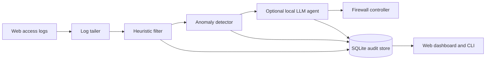

# MorphIQ

[](https://www.python.org/downloads/)
[](LICENSE)
[](#project-status)

MorphIQ is a local-first, AI-assisted intrusion prevention system for web servers. It tails access logs, filters known attack patterns, scores anomalous requests, and can ask a local language model for a final threat assessment before applying a firewall rule.

> [!IMPORTANT]
> MorphIQ is alpha software. Start with the `mock` firewall backend, review its decisions, and test in a non-production environment before granting firewall privileges.

## Why MorphIQ

- **Layered detection** — heuristic signatures, Isolation Forest anomaly scoring, and optional LLM assessment.
- **Local-first operation** — logs, models, audit records, and decisions remain on the host.
- **Automated response** — supports Windows Firewall, `iptables`, `ufw`, and a safe mock backend.
- **Operational visibility** — SQLite-backed audit history, active-ban management, and a live dashboard.
- **Configurable deployment** — YAML configuration, environment override, and an interactive setup command.

## Architecture



MorphIQ supports Nginx combined, Apache combined, IIS W3C, Caddy JSON, and custom regex log formats.

## Quick start

### Requirements

- Python 3.11 or newer
- Windows, Linux, or macOS for mock-mode development
- Windows or Linux for firewall enforcement
- Optional: an OpenAI-compatible local model server, such as LM Studio

### Install

```bash
git clone https://github.com/aakanshajagga14/morphiq.git
cd morphiq
python -m venv .venv
```

Activate the environment:

```bash
# macOS/Linux
source .venv/bin/activate

# Windows PowerShell
.venv\Scripts\Activate.ps1
```

Install MorphIQ:

```bash
python -m pip install --upgrade pip
python -m pip install -e .
```

### Configure

The committed [`config.yaml`](config.yaml) is a safe demo configuration. It reads `demo_access.log`, disables the LLM, and uses the mock firewall backend.

You can also launch the setup wizard:

```bash
morphiq setup
```

At minimum, review these values before running against real traffic:

```yaml
log_file_path: /var/log/nginx/access.log
log_format_preset: nginx_combined
firewall_backend: mock
whitelist:
  - 127.0.0.1
  - "::1"
llm_enabled: false
dashboard_enabled: true
dashboard_host: 127.0.0.1
dashboard_port: 7373
```

Use `MORPHIQ_CONFIG` or `--config` to select another configuration file:

```bash
MORPHIQ_CONFIG=/etc/morphiq/config.yaml morphiq status
morphiq start --config ./config.yaml
```

### Run

```bash
morphiq start
morphiq status
morphiq dashboard
morphiq stop
```

With the default configuration, open [http://127.0.0.1:7373](http://127.0.0.1:7373).

## CLI

| Command | Purpose |
| --- | --- |
| `morphiq setup` | Create a configuration interactively. |
| `morphiq start` | Start the daemon in the background. |
| `morphiq stop` | Stop the daemon. |
| `morphiq status` | Show daemon and pipeline statistics. |
| `morphiq audit` | Display recent threat decisions. |
| `morphiq ban list` | List active bans. |
| `morphiq unban <ip>` | Remove an active ban. |
| `morphiq whitelist check <ip>` | Check whether an address is protected. |
| `morphiq feedback <ip> <fp|tp>` | Record false-positive or true-positive feedback. |
| `morphiq retrain` | Retrain the anomaly model from stored traffic. |
| `morphiq dashboard` | Open the configured dashboard. |

Run `morphiq --help` or `morphiq <command> --help` for the complete command reference.

## Local LLM integration

MorphIQ can connect to a local OpenAI-compatible endpoint. To enable it:

1. Start the model server and load an instruction-tuned model.
2. Set `llm_enabled: true`.
3. Set `llm_base_url`, `llm_model_path`, and the context/token limits in `config.yaml`.
4. Restart MorphIQ and review decisions in the audit log.

The LLM layer is optional. If it is disabled or unavailable, MorphIQ continues in heuristic/anomaly mode.

## Development

```bash
python -m pip install -e ".[dev]"
pytest
```

See [CONTRIBUTING.md](CONTRIBUTING.md) for the contribution workflow and [SECURITY.md](SECURITY.md) for responsible vulnerability reporting.

## Project status

MorphIQ is under active development. Interfaces, configuration fields, and detection behavior may change before a stable release. It should be treated as an additional security control—not a replacement for patching, least privilege, network segmentation, or established monitoring.

## License

MorphIQ is available under the [MIT License](LICENSE).
