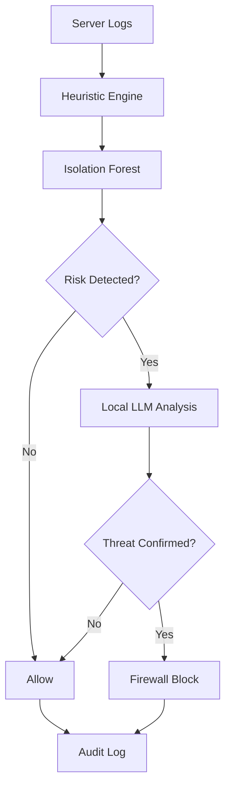

# Morphiq

**A local-LLM-powered intrusion prevention system for real-time, explainable threat response.**

Morphiq monitors web server traffic, detects malicious behaviour, and automatically blocks confirmed threats. It combines deterministic security rules, anomaly detection, and local LLM reasoning—keeping sensitive traffic data on-device while producing an auditable explanation for every security decision.

## Why Morphiq?

Traditional intrusion prevention systems depend heavily on static signatures. Morphiq uses a layered detection pipeline to identify both known attacks and unusual behaviour:

```text
Web Traffic
    ↓
Heuristic Threat Detection
    ↓
Isolation Forest Anomaly Detection
    ↓
Local LLM Security Assessment
    ↓
Allow · Flag · Block
    ↓
Explainable Audit Log
```

Only suspicious requests are escalated to the LLM, reducing inference overhead and limiting unnecessary model involvement.

## Detection Pipeline

### 1. Deterministic Security Layer

Detects known attack signatures, including:

* SQL injection
* Cross-site scripting
* Path traversal
* Command injection
* Malicious payload patterns

### 2. Behavioural Anomaly Layer

An Isolation Forest model evaluates signals such as:

* Request frequency
* Path and payload length
* Query entropy
* Access patterns
* Traffic irregularities

### 3. Local LLM Reasoning Layer

Ambiguous requests are analyzed by a locally hosted model such as Gemma or Llama. The model receives the request context, triggered indicators, and recent traffic history before returning:

* Threat classification
* Confidence assessment
* Supporting rationale
* Recommended action

The LLM acts as a bounded analysis layer—not the sole security authority.

## Safety-by-Design

Morphiq is built around four security principles:

* **Local inference:** Sensitive traffic stays on the host system.
* **Layered validation:** No single model determines the complete security outcome.
* **Explainable decisions:** Every action is recorded with its supporting signals.
* **Configurable enforcement:** Detection and blocking thresholds remain operator-controlled.

## Core Features

* Real-time Nginx, Apache, and IIS log monitoring
* Heuristic and ML-based threat detection
* Local LLM integration through an OpenAI-compatible API
* Automated firewall-level IP blocking
* Structured security audit trails
* Real-time React monitoring dashboard
* SQLite-backed event storage
* Configurable detection and enforcement policies
* Offline demo mode for simulated attacks

## Architecture



Morphiq consists of:

* **Daemon:** Monitors logs, executes the detection pipeline, queries the local model, stores events, and manages firewall actions.
* **Dashboard:** Displays live traffic, detected threats, active bans, model assessments, and decision traces.

## Tech Stack

* Python 3.11+
* Isolation Forest / scikit-learn
* Local LLMs via LM Studio
* Gemma, Llama, or compatible models
* `aiohttp`
* SQLite
* React
* Windows Firewall via `netsh`

## Configuration

Configure Morphiq through `config.yaml`:

```yaml
log_file_path: demo_access.log

llm_enabled: true
llm_base_url: http://localhost:1234/v1

dashboard_port: 3000
```

| Option           | Purpose                                    |
| ---------------- | ------------------------------------------ |
| `log_file_path`  | Web server log monitored by Morphiq        |
| `llm_enabled`    | Enables local LLM assessment               |
| `llm_base_url`   | OpenAI-compatible local inference endpoint |
| `dashboard_port` | Port used by the monitoring dashboard      |

## Run Morphiq

Start the daemon and dashboard:

```bash
morphiq start
```

Stop Morphiq:

```bash
morphiq stop
```

Open the dashboard:

```text
http://127.0.0.1:3000
```

## Local LLM Setup

1. Load an instruction-tuned model in LM Studio.
2. Start the local server on port `1234`.
3. Enable the LLM layer in `config.yaml`.
4. Run Morphiq.

For resource-constrained systems, use a smaller quantized model, set parallel requests to `1`, and reduce the context length to `4096`.

Morphiq can also operate without an LLM using only its deterministic and anomaly-detection layers.

## Demo Mode

Point `log_file_path` to `demo_access.log` and append simulated benign or malicious requests. Morphiq will process each event through the complete pipeline and display the resulting decision in real time.

## Research Direction

Morphiq explores how local language models can support security enforcement without becoming an opaque or unrestricted decision-maker.

Current research directions include:

* Measuring false-positive reduction from LLM escalation
* Comparing heuristic, ML, and hybrid detection pipelines
* Evaluating local-model latency and resource requirements
* Defending the analysis layer against prompt injection
* Adding human approval for high-impact enforcement actions
* Calibrating model confidence against observed attack outcomes

> Morphiq is a research prototype. Validate its behaviour in a controlled environment before enabling automated blocking on production systems.

## License

MIT License. See [`LICENSE`](LICENSE).
